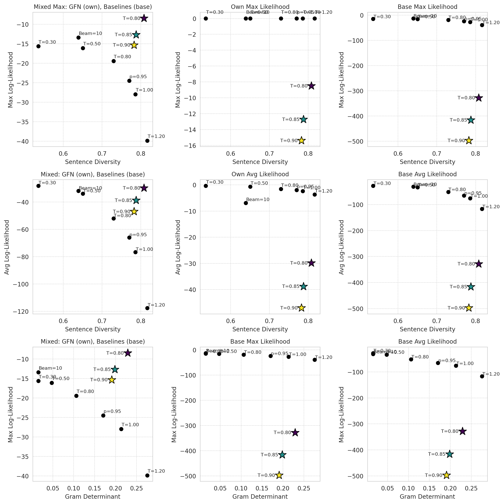

# GFlowNet fine-tuning for next sentence continuation

Open reproduction of GFlowNet fine-tuning for next sentence continuation experiment. Builds on [the original repo](https://github.com/GFNOrg/gfn-lm-tuning/). See below to download the finetuned models.

- `job_train.sh $TEMP` will run the authors' script to train GPT2-XL on the next sentence continuation task with GFlowNet steering towards the global temperature target distribution.
- `checkpoint_to_peft.py` converts the checkpoints to lightweight PEFT format files.
- `replicate_experiment.py` runs the inference to reproduce the figure in the paper. Outputs a CSV file. 
- `plot.ipynb` plots the results from the CSV file.

## TLDR

### ⚠️ Beware of how likelihood is computed for evaluation. 
The figure in the original paper (first plot) can be reproduced _only_ by evaluating the GFlowNet models under their own likelihoods, while evaluating baseline models (e.g., temperature sampling) under the base $T=1$ GPT-2 XL likelihood.

Next plots of the first row show what happens if you instead:

1. Evaluate both GFlowNet and baselines under their own likelihoods (fair comparison under own likelihood).

2. Evaluate both under the same fixed base model likelihood (fair comparison under base model).

The second row of plots repeats the comparison but switches from using maximum likelihood to average likelihood over sequences.
The final row changes the x-axis from average cosine similarity to the determinant of the Gram matrix of the sentence embeddings.

## Notes
- "Own likelihood" means $p_{\theta}(x)$ under the model $\theta$ that generated the sequence $x$.

- "Base likelihood" means $p_{\text{GPT-2 XL}}(x)$ where GPT-2 XL is fixed at $T=1$ (no fine-tuning or local temperature applied).

## Finetuned models
I uploaded to the Hugging Face Hub the GFN fine-tuned models for the next sentence continuation task that reproduce the paper figure. You can find them here:
- [manueldeprada/gflownet-next-sentence-gpt2xl-0.8](https://huggingface.co/manueldeprada/gflownet-next-sentence-gpt2xl-0.8) (temperature 0.8)
- [manueldeprada/gflownet-next-sentence-gpt2xl-0.85](https://huggingface.co/manueldeprada/gflownet-next-sentence-gpt2xl-0.85) (temperature 0.85)
- [manueldeprada/gflownet-next-sentence-gpt2xl-0.90](https://huggingface.co/manueldeprada/gflownet-next-sentence-gpt2xl-0.90) (temperature 0.9)

The models are in PEFT format and can be loaded with the `peft` library:
```python
from transformers import AutoTokenizer
from peft import AutoPeftModelForCausalLM

model = AutoPeftModelForCausalLM.from_pretrained("manueldeprada/gflownet-next-sentence-gpt2xl-0.8", torch_dtype="auto", device_map="auto")
tokenizer = AutoTokenizer.from_pretrained("gpt2-xl")

inputs = tokenizer("The meaning of life is", return_tensors="pt").to(model.device)
outputs = model.generate(**inputs, max_new_tokens=50)
print(tokenizer.decode(outputs[0], skip_special_tokens=True))
```